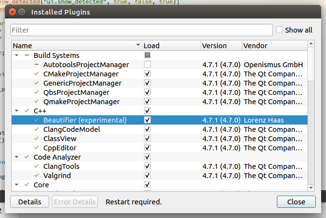
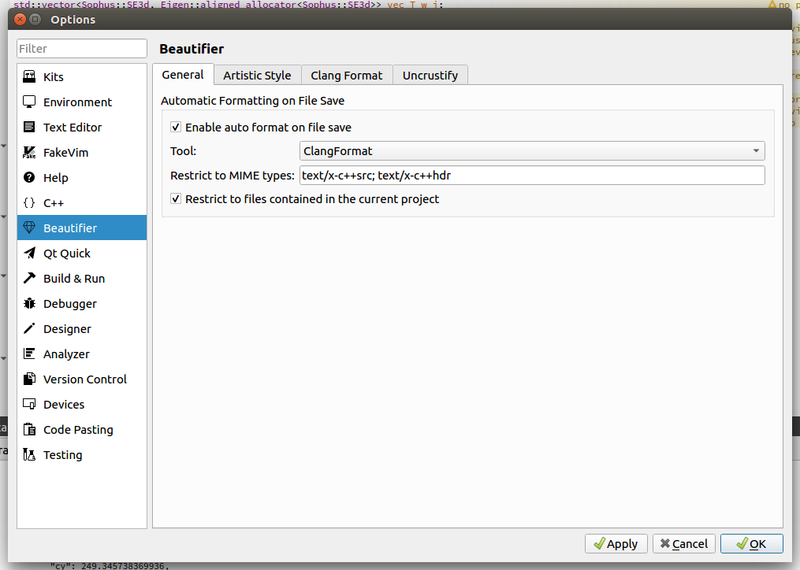
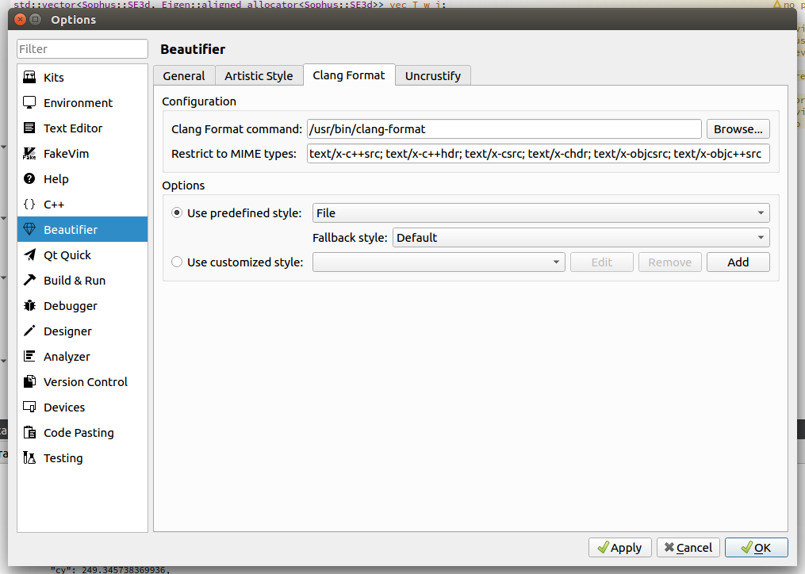
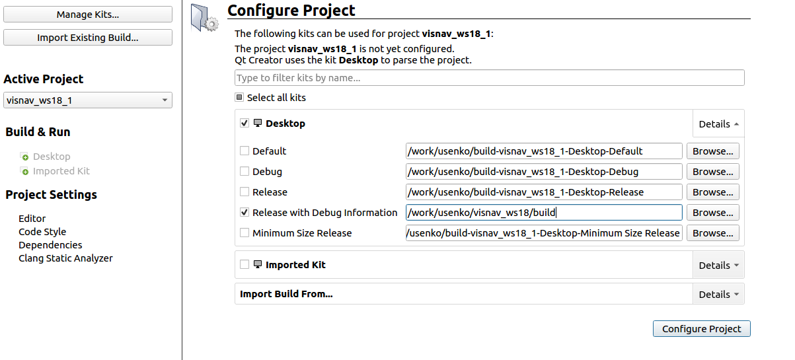
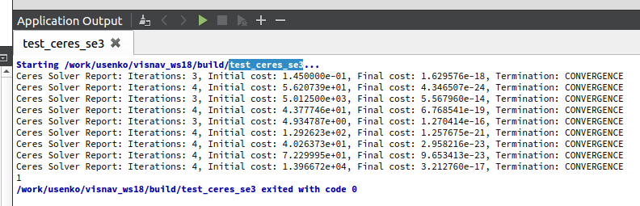

## Preliminaries and tutorials
Git:
* https://learngitbranching.js.org/

CMake:
* https://cmake.org/cmake-tutorial/
* https://github.com/ttroy50/cmake-examples

Ceres:
* http://ceres-solver.org/nnls_tutorial.html#curve-fitting
* https://ceres-solver.googlesource.com/ceres-solver/+/master/examples/curve_fitting.cc

## Installation

Clone the repository on your PC. If you are doing this on the lab PCs **DO NOT** install it in your home folder because it is stored in the network. Make a directory `/work/<username>` (`/work/` is your local hard drive) and install everything there.
```
git clone git@gitlab.vision.in.tum.de:visnav_ws19/<username>/visnav.git
```

### Install and configure QtCreator
Download and install QtCreator

On the lab PCs, just do
```
sudo apt install qtcreator-4.8
```
and then start QtCreator from the terminal with the command `qtcreator-4.8`.

> **Note:** You can also manually install any version of QtCreator.
> Best install on the local harddrive in `/work/<username>`:
>
> ```
> wget https://download.qt.io/official_releases/qtcreator/4.8/4.8.2/qt-creator-opensource-linux-x86_64-4.8.2.run
> chmod +x qt-creator-opensource-linux-x86_64-4.8.2.run
> ./qt-creator-opensource-linux-x86_64-4.8.2.run
> ```

After installation, go to `Help` -> `About plugins...` in the menu and enable Beautifier plugin:



Go to `Tools` -> `Options` and select the Beautifier tab. There select ClangFormat as the tool in `General` tab.



Select file as predefined style in `Clang Format` tab. Also select `None` as the fallback style.



### Build project
First, install the dependencies and build project sub-modules.
```
cd visnav
./install_dependencies.sh
./build_submodules.sh
```

In QtCreator configure the project with `Release with Debug Info` configuration. The build directory should point to `/<your_installation_path>/visnav/build`.



After that you should be able to build and run the project. To verify that installation worked well run the `test_ceres_se3` executable. You should get the following output:




## Code submission
Every exercise contains a set of automatic tests that verify the correctness of the solution.
All test are located in the `test` folder.
By default only the `test_ex0` is un-commented in CMake, such that you can test the submission system.
To run the tests you should push your changes to your own branch and make a merge request against the `master` branch.
This will show the changed files and automatically run tests on the server.
If all tests passed your solution is correct and we will merge the changes in your `master` branch.
It is best to start a new branch for every exercise sheet, such that you can start work on the next exercise while waiting for you merge request to be verified and merged.


## FAQ

### 1. Can I access the lab machines from home via SSH?

You can access lab PCs using the following command
```
ssh -p 58022 <your_username>@atcremers55.informatik.tu-muenchen.de
```
You should use the hostname of your PC instead of `atcremers55`.

### 2. Do I need to use QtCreator? I prefer another IDE...

We don't require you to use QtCreator, but we recommend it for the
following reasons:

- decent cmake support
- option to run clang-format on file-save
- good visual debugger
- code-navigation and syntax highlighting works well (mostly)

If you use another IDE, please make sure that clang-format is run
before committing files. You can also use the `run_format.sh` script
to reformat all files before commiting.

### 3. Compilation is slow...

Yes, compile times can unfortunately be slow.

When developing, make sure to only compile as much as is needed, not
all executables.  For example, from the command line call `make
-j4 calibration`, to only build the `calibration` executable.

In QtCreator, you can go to `Projects -> Build -> Build Steps ->
Targets` and select `Current Executable` instead of `all`, to only
build the currently selected executable when running "build"
(Ctrl+B). The current executable is the one selected for "running".

### 4. Eigen troubleshooting

We include a recent version of Eigen in the project as a submodule to make sure everyone uses the same exact version. Often errors related to Eigen are caused by the compiler picking up the system-wide Eigen version instead of the Eigen version provided in the project.

##### Check cmake output

One thing you should always do to troubleshoot Eigen is carefully checking the cmake output. Cmake tells you where it detected Eigen. If this is inside your project folder `.../thirdparty/eigen/`, then that seems ok.

```
Found required Ceres dependency: Eigen version 3.3.4 in /Users/demmeln/work/teaching/visnav_ws18/visnav_ws18/thirdparty/eigen
```

Otherwise, Eigen detected in `/usr/local/...` might be problematic.

##### Use correct include paths

One other cause of Eigen errors like

```
visnav_ws18/thirdparty/Sophus/sophus/so2.hpp:98:40: error: 'ScalarBinaryOpTraits' in namespace 'Eigen' does not name a template type
   using ReturnScalar = typename Eigen::ScalarBinaryOpTraits<
```

is if you use `#include <eigen3/Eigen/...>`, since this again will find the system-wide Eigen version in `/usr/local/eigen3/Eigen/...`. Instead, use `#include <Eigen/...>`.
